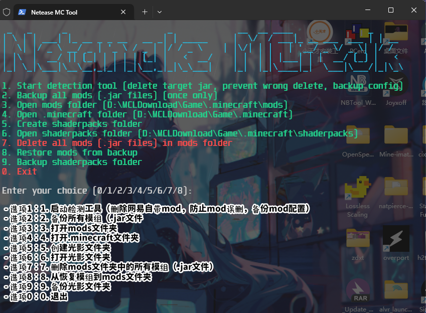
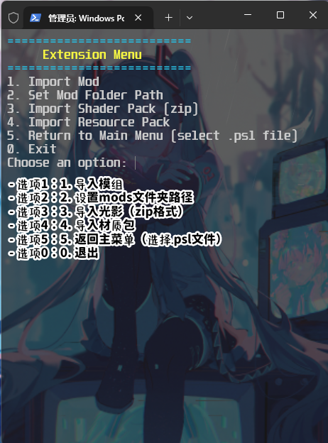

# 🚀 冈易我上早八！(本工具纯Ai制作本人不想从中获取任何利益)(给我look you give me 利益 我 Break your 两双手！)
  
> ⚡能让你突破冈易java限制让你轻松使用国际版的模组，但也有坏处，部分国际版模组可能不兼容网易的forge
冈易JAVA 1.7.10--1.21都是用forge

---

## ✨ 让我们看看都TMD有哪些功能😡

- 🛠 **功能 1** - 可直接跳过某些模组加载并顺利加载原版java界面干掉冈易自带模组4681704866889354274@3@0.jar
- --------------------------------------
- 📋**功能 2** - 简单易懂操作界面，哦！，真TM可见的大小这工具是真的小
- --------------------------------------
- 📁**功能 3** - TMD一键备份国际版模组，扩展功能可以下载仓库本地给您的模组整合，不让您导入的国际版模组突然消失，哦，想想都想干他一炮
- --------------------------------------
- ⚡**功能 4** - 一键导入模组，简单易懂，小宝宝都知道怎么用(感觉有点夸张了因为我颠了)
----------------------------------------
## 网易自带模组样本 ##
[4681704866889354274@3@0.jar](4681704866889354274@3@0.jar)
  
## 🤓让我们翻译这些鸟语





## 😁 后语  

非常欢迎各大牛逼的人来参考脚本并开发出各种各样牛逼的工具，本工具纯AI制作还有我不想从中获取利益，公开学习使用，任何人都可以使用它

## 系统要求

Python 3.6+
Windows操作系统

## 安装步骤

1.安装Python依赖

psutil
```bash
pip install psutil
```

pywinauto
```bash
pip install pywinauto
```

2.运行exe，py

## 使用说明

1.打开工具，在运行你的版本，如1.7.10-1.21
启动任意存档，然后加载至90%之后，使用该工具的第一个选项，


